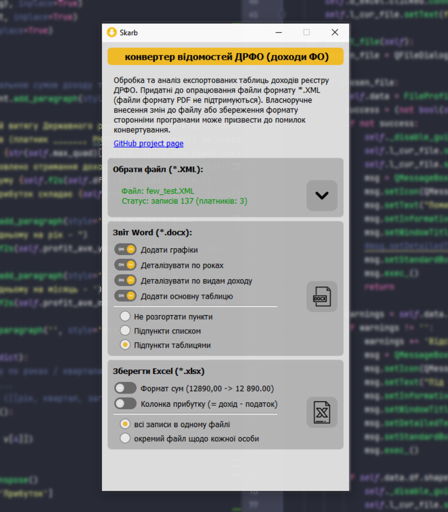
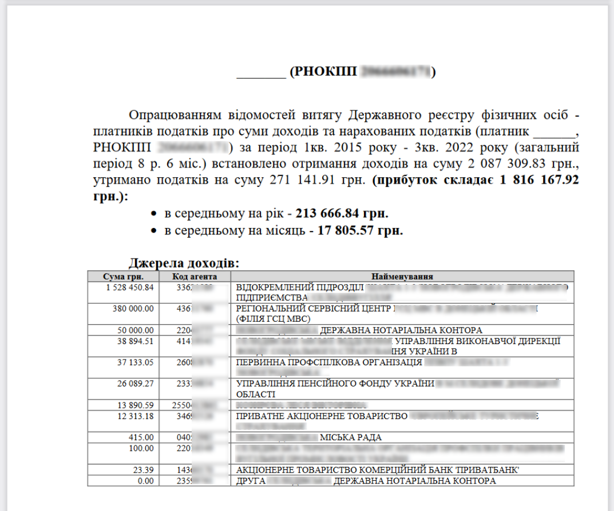

# Skarb

Обробка та зведення загальних показників експортованих таблиць доходів ДРФО (J1703502.xsd XML scheme)

## Імпорт файлів

Придатні до опрацювання файли формату *.XML (файл формату PDF не опрацьовується), отримані від офіційного розпорядника. 
Власноручне внесення змін до файлу або збереження формату сторонніми програмами може призвести до унеможливлення 
конвертування.

## Експорт

- форматовані таблиці MS Excel
- звіти MS Word:
  
### Загальні та середні суми доходів, джерела доходів:

### Деталізація доходів щорічно:

### Деталізація доходів за видами надходжень:

### Форматована таблиця записів реєстру для друку:

    

## Збірка проекту
1. venv python 3.9 
2. requirements.txt 
3. cd project_dir 
4. pyinstaller --path project_dir\venv\Lib\site-packages --noconfirm --windowed --onefile --icon project_dir/app_icon.ico --name skarb project_dir/main.py

## Credits:
Used in GUI:
- https://www.flaticon.com/free-icons/excel - Excel icons created by Freepik - Flaticon
- https://www.flaticon.com/free-icons/microsoft-word - Microsoft word icons created by Bharat Icons - Flaticon
- https://www.flaticon.com/free-icons/excel - Excel icons created by Bharat Icons - Flaticon