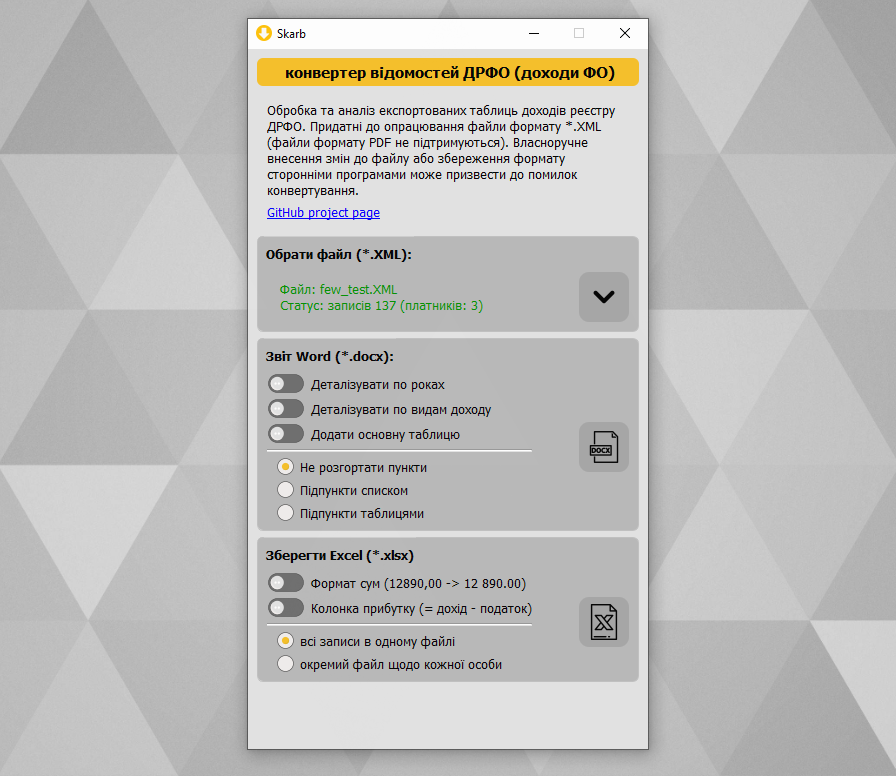
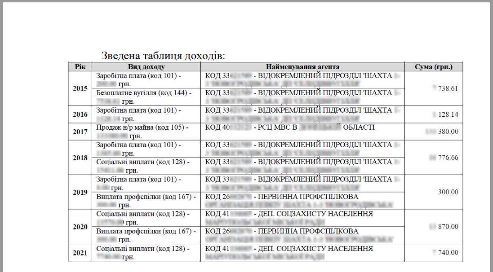
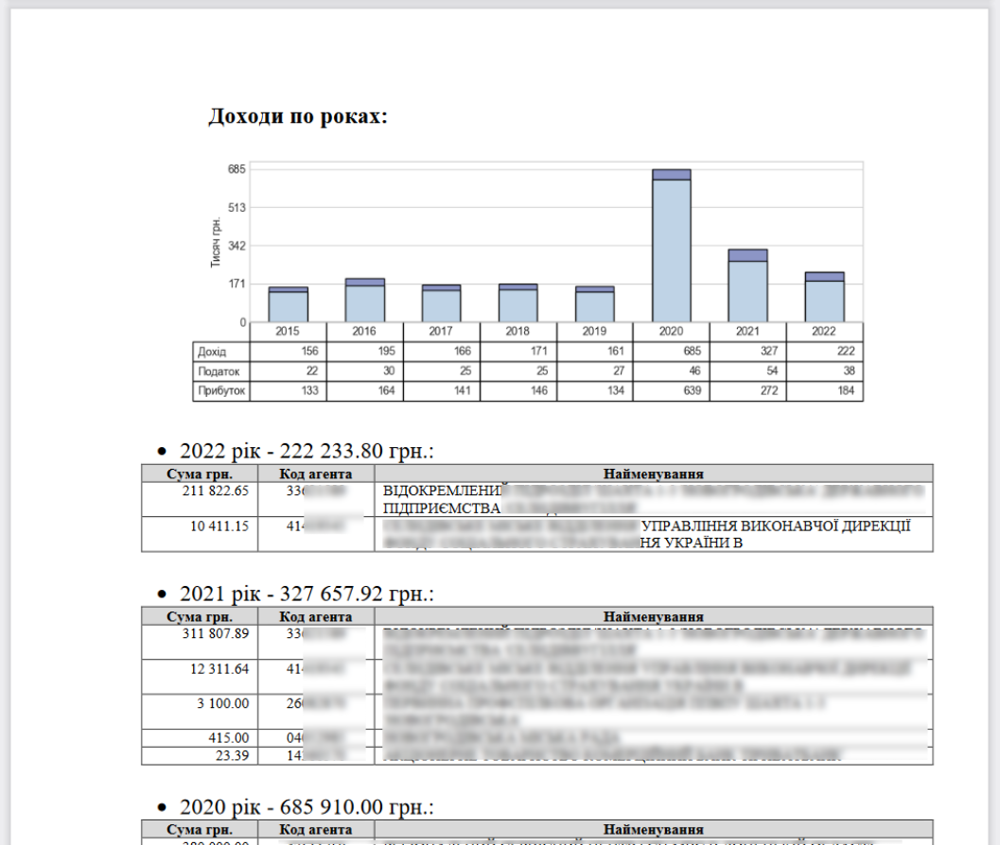
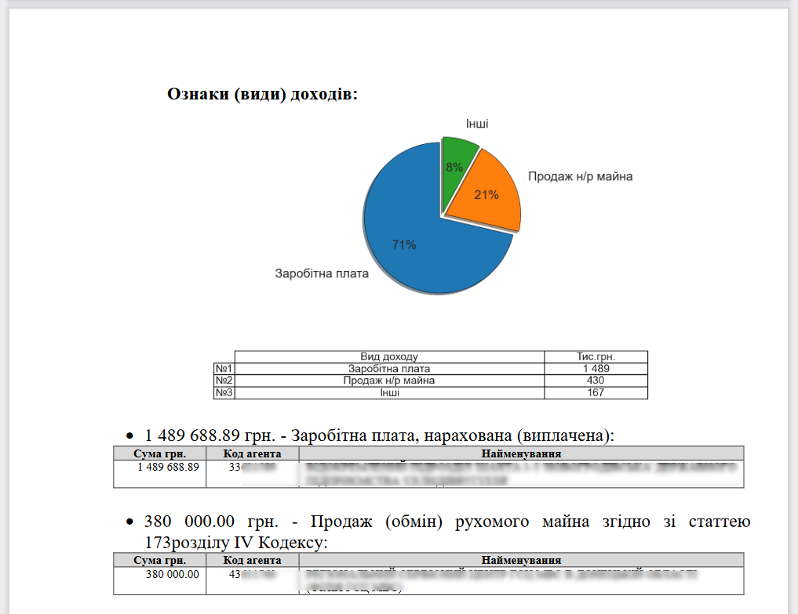
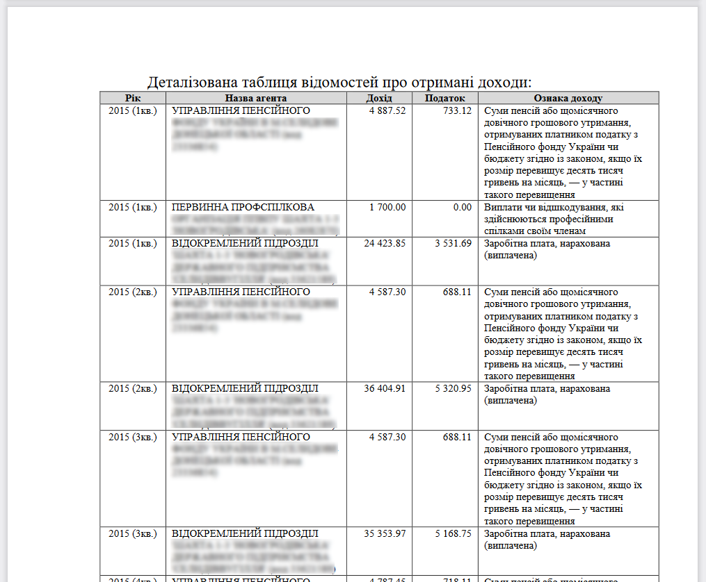

# Skarb
[-blue?style=for-the-badge&logo=appveyor)](https://github.com/OlehOleinikov/Skarb/releases/download/v0.4-beta/skarb-0.4b.exe)

Обробка та зведення загальних показників експортованих таблиць доходів ДРФО (J1703502.xsd - XML scheme)

## Імпорт файлів

- Підтримуються файли формату *.XML (".PDF" не придатні для завантаження)
- Отримані від офіційного розпорядника реєстру
- Власноручне внесення змін до файлу або збереження формату сторонніми програмами може призвести до унеможливлення конвертування

## Опрацювання вхідних даних
- Суми прибутку зазначаються з розрахунку різниці доходу та нарахованого податку
- Для діяльності ФОП враховуються декларації тільки останнього відомого звітного періоду року (коди: 506, 509, 512). Якщо наявні записи про 6-ти та 9-місячний звіти у поточному році - буде враховано тільки 9-місячний. В якості джерела доходу вказується сама особа з власним кодом РНОКПП, до статистики загальної суми доходи зазначається - ***Доходи власної підприємницької діяльності***
- Записи про декларації фізичних осіб (коди: 888, 999) не враховуються у звітах та експорті таблиць
- У звітах використовуються прийняті скорочення:
    - організаційно-правових форм юридичних осіб (*Товариство з обмеженою в...* -> ***ТОВ***) 
    - найменувань ознак (видів) доходу (*Дохід, отриманий у спадщину (подарований) від члена сім'ї першого ступеня споріднення* -> ***Спадщина***)

## Експорт

- форматовані таблиці MS Excel
- звіти MS Word:
  
### Загальні та середні суми доходів, джерела доходів:

### Зведена таблиця:

### Деталізація доходів по роках:

### Деталізація доходів за видами:

### Форматована таблиця всіх записів для друку:

    

## Збірка проекту
1. venv python 3.9 
2. requirements.txt 
3. cd project_dir 
4. pyinstaller --path project_dir\venv\Lib\site-packages --noconfirm --windowed --onefile --icon project_dir/app_icon.ico --name skarb project_dir/main.py

## Credits:
Used in GUI:
- https://www.flaticon.com/free-icons/excel - Excel icons created by Freepik - Flaticon
- https://www.flaticon.com/free-icons/microsoft-word - Microsoft word icons created by Bharat Icons - Flaticon
- https://www.flaticon.com/free-icons/excel - Excel icons created by Bharat Icons - Flaticon